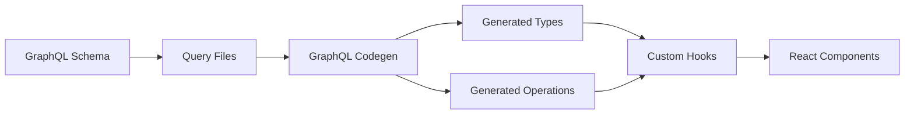

The Openlane UI uses [@graphql-codegen](https://the-guild.dev/graphql/codegen) to automatically generate TypeScript types and hooks from GraphQL queries. This ensures type safety and reduces boilerplate code.

## How It Works

When interacting with the Openlane Core API, most requests use the [GraphQL API](https://api.theopenlane.io/query). Code generation creates TypeScript types from your queries automatically.

### Workflow



## Adding a New Query

Follow these steps to add a new GraphQL query or mutation:

### 1. Create or Update Query File

Add your query to `/packages/codegen/query/`. Queries should be added to a file relevant to the object(s) being used.

For example, add organization queries to `organization.graphql`:

```typescript
import { gql } from 'graphql-request'

export const GET_ORGANIZATION_NAME_BY_ID = gql`
  query GetOrganizationNameByID($organizationId: ID!) {
    organization(id: $organizationId) {
      name
      displayName
    }
  }
`
```

<Tip>
Use the [Apollo GraphQL Explorer](https://studio.apollographql.com/sandbox/explorer) to help create the correct GraphQL query syntax.
</Tip>

### 2. Run Code Generation

Execute the task command to generate types and hooks:

```bash
task codegen:codegen
```

This command:
- Runs the `generate` command to create TypeScript types
- Runs a `clean` command for necessary cleanup on generated files

<Note>
The clean step fixes import paths for `graphql-request` types. See [issue #501](https://github.com/dotansimha/graphql-code-generator-community/issues/501).
</Note>

## Configuration

The codegen behavior is configured in `graphql-codegen.yml`:

```yaml packages/codegen/graphql-codegen.yml
config:
  strict: true
  useTypeImports: true
  exposeDocument: true
  exposeQueryKeys: true
  addInfiniteQuery: true
  exposeMutationKeys: true
  exposeFetcher: true
  optimizeDocumentNode: true
  maybeValue: T | null
  declarationKind: interface
  preResolveTypes: true
  onlyOperationTypes: false
  flattenGeneratedTypes: false
  namingConvention:
    enumValues: keep
  scalars:
    DateTime: string
    Date: string
    Decimal: number
    UUID: string
    ID: string
    JSON: any
    Upload: any
  schema: yup

overwrite: true
schema: https://raw.githubusercontent.com/theopenlane/core/main/internal/graphapi/clientschema/schema.graphql
documents: './query/**/*.ts'

generates:
  ./src/introspectionschema.json:
    plugins:
      - introspection
  ./src/schema.ts:
    plugins:
      - typescript
      - typescript-operations
      - add:
          content: '/* eslint-disable */'

hooks:
  afterAllFileWrite:
    - node ./plugins/generate-type-constants.js
    - node ./plugins/generate-queries.js
    - node ./plugins/generate-hooks.js
```

### Key Configuration Options

| Option | Description |
|--------|-------------|
| `exposeDocument` | Adds document field to each query hook for use with `queryClient.fetchQuery` |
| `exposeQueryKeys` | Adds `getKey(variables)` function for cache updates |
| `exposeMutationKeys` | Adds `getKey()` function to mutation hooks |
| `exposeFetcher` | Adds fetcher field for prefetching |
| `addInfiniteQuery` | Generates infinite query variants |
| `useTypeImports` | Uses TypeScript `import type` syntax |

### Scalar Mappings

GraphQL scalars are mapped to TypeScript types:

```typescript
DateTime: string
Date: string
Decimal: number
UUID: string
ID: string
JSON: any
Upload: any
```

## Generated Files

Code generation produces several files:

### `/packages/codegen/src/schema.ts`

Contains:
- Base TypeScript types from the GraphQL schema
- Operation types for queries and mutations
- Type-safe variables for each operation

### `/packages/codegen/src/introspectionschema.json`

Introspection data for tooling and IDE support.

### `/packages/codegen/src/type-names.ts`

Generated constants for type names (via custom plugin).

## Custom Plugins

The codegen process uses custom plugins to generate additional files:

### generate-hooks.js

Automatically generates React Query hooks in `/apps/console/src/lib/graphql-hooks/`:

```typescript
export const useGetAllOrganizations = () => {
  const { client } = useGraphQLClient()

  return useQuery<GetAllOrganizationsQuery>({
    queryKey: ['organizations'],
    queryFn: async () => client.request(GET_ALL_ORGANIZATIONS),
  })
}
```

The plugin:
- Scans query files for GraphQL operations
- Generates typed hooks using React Query
- Adds automatic cache invalidation
- Supports queries, mutations, and bulk operations

### Other Plugins

- `generate-type-constants.js` - Creates constant exports for type names
- `generate-queries.js` - Additional query utilities

## Task Commands

Available tasks in `Taskfile.yaml`:

```yaml
tasks:
  codegen:
    desc: run generate + clean
    cmds:
      - task: generate
      - task: clean

  generate:
    desc: run generate
    cmds:
      - bun run codegen --verbose
      - bun run prettier --write src/schema.ts

  clean:
    desc: clean up badly generated code
    cmd: sed -i.bak "s|'graphql-request/dist/types'|'graphql-request'|g" src/schema.ts && rm -f src/schema.ts.bak
```

## Dependencies

Key packages used for code generation:

```json
{
  "dependencies": {
    "@graphql-tools/schema": "10.0.31",
    "graphql": "16.13.0",
    "graphql-codegen-plugin-typescript-swr": "^0.8.5",
    "graphql-codegen-typescript-validation-schema": "^0.18.0",
    "graphql-request": "7.4.0",
    "typescript": "5.9.3"
  },
  "devDependencies": {
    "@graphql-codegen/add": "6.0.0",
    "@graphql-codegen/cli": "6.1.2",
    "@graphql-codegen/introspection": "5.0.0",
    "@graphql-codegen/typescript": "5.0.8",
    "@graphql-codegen/typescript-document-nodes": "5.0.8",
    "@graphql-codegen/typescript-operations": "5.0.8",
    "@graphql-codegen/typescript-resolvers": "5.1.6"
  }
}
```

## Best Practices

<Card title="Organize by Domain" icon="folder">
Group related queries in files by domain object (e.g., `user.ts`, `organization.ts`).
</Card>

<Card title="Regenerate After Schema Changes" icon="rotate">
Run `task codegen:codegen` whenever the GraphQL schema updates.
</Card>

<Card title="Use Apollo Explorer" icon="magnifying-glass">
Test queries in [Apollo GraphQL Explorer](https://studio.apollographql.com/sandbox/explorer) before adding them.
</Card>

<Card title="Type Safety" icon="shield">
Always use the generated TypeScript types for variables and responses.
</Card>
