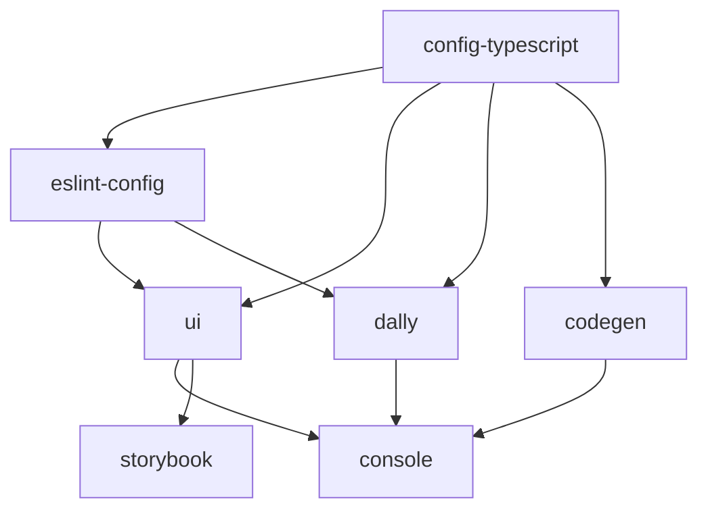

## Overview

Openlane UI is built as a monorepo using [Turborepo](https://turbo.build/repo), managed by [Bun](https://bun.sh/). This structure enables efficient code sharing, unified build processes, and streamlined dependency management across all applications and packages.

<CardGroup cols={2}>
  <Card title="Apps" icon="window">
    2 production applications
  </Card>
  <Card title="Packages" icon="box">
    5 shared internal packages
  </Card>
  <Card title="Build Tool" icon="gear">
    Turborepo 2.8.10
  </Card>
  <Card title="Package Manager" icon="package">
    Bun 1.2.16
  </Card>
</CardGroup>

## Workspace Structure

The monorepo is organized using Bun workspaces, defined in the root `package.json`:

```json
"workspaces": [
  "apps/*",
  "packages/*"
]
```

### Directory Layout

```
openlane-ui/
├── apps/
│   ├── console/          # Main Openlane Console application
│   └── storybook/        # Component documentation and testing
├── packages/
│   ├── ui/               # Shared UI component library
│   ├── codegen/          # GraphQL code generation
│   ├── dally/            # Data Access Layer (DAL)
│   ├── eslint-config/    # Shared ESLint configurations
│   └── config-typescript/# Shared TypeScript configurations
├── turbo.json            # Turborepo configuration
└── package.json          # Root package configuration
```

## Turborepo Configuration

The `turbo.json` file defines task pipelines and dependencies:

<Accordion title="Build Task Configuration">
```json
"build": {
  "dependsOn": ["^build"],
  "outputs": ["dist/**", ".next/**", "!.next/cache/**", "storybook-static/**"]
}
```

- **dependsOn**: Ensures dependencies are built before dependents
- **outputs**: Defines cacheable build artifacts
- **Environment variables**: 40+ environment variables for builds
</Accordion>

<Accordion title="Dev Task Configuration">
```json
"dev": {
  "cache": false,
  "persistent": true
}
```

- **cache**: Disabled for development to ensure fresh builds
- **persistent**: Keeps dev servers running
</Accordion>

<Accordion title="Global Dependencies">
```json
"globalDependencies": ["**/.env.*local", "**/.env", ".env"]
```

Turborepo watches these files and invalidates caches when they change.
</Accordion>

## Available Scripts

The root `package.json` provides workspace-wide commands:

| Script | Command | Description |
|--------|---------|-------------|
| `build` | `turbo build` | Build all apps and packages |
| `dev` | `turbo dev --parallel` | Run all dev servers in parallel |
| `debug` | `turbo debug` | Debug Turborepo configuration |
| `type-check` | `turbo type-check` | Type-check all TypeScript code |
| `lint` | `turbo run lint` | Lint all workspaces |
| `clean` | (custom script) | Remove all node_modules and build artifacts |
| `turbo-clean` | `turbo clean` | Clean Turborepo cache |
| `format` | `prettier --write "**/*.{ts,tsx,md}"` | Format all code |

## Workspace Dependencies

Internal packages are referenced using the `workspace:*` protocol:

```json
// In apps/console/package.json
"dependencies": {
  "@repo/codegen": "workspace:*",
  "@repo/dally": "workspace:*",
  "@repo/ui": "workspace:*"
}
```

This ensures:
- Always uses the latest local version
- Enables hot module reloading across packages
- Simplifies version management

## Build Pipeline

Turborepo automatically determines the optimal build order:



## Performance Benefits

<CardGroup cols={2}>
  <Card title="Incremental Builds" icon="rocket">
    Only rebuilds changed packages and their dependents
  </Card>
  <Card title="Remote Caching" icon="cloud">
    Share build caches across team members and CI/CD
  </Card>
  <Card title="Parallel Execution" icon="gauge-high">
    Runs independent tasks simultaneously
  </Card>
  <Card title="Smart Hashing" icon="fingerprint">
    Detects changes based on content, not timestamps
  </Card>
</CardGroup>

## Engine Requirements

The monorepo enforces specific runtime versions:

```json
"engines": {
  "node": "24.14.x"
},
"packageManager": "bun@1.2.16"
```

<Warning>
  Using different versions of Node.js or Bun may cause compatibility issues. Always use the specified versions.
</Warning>

## Dependency Resolution

The root `package.json` includes resolution overrides to ensure consistency:

```json
"resolutions": {
  "react": "19.2.4",
  "gaxios": "^7.0.0",
  "node-fetch": "^3.3.2"
}
```

This prevents version conflicts across the entire monorepo.

## Best Practices

<AccordionGroup>
  <Accordion title="Adding New Packages">
    1. Create a new directory in `packages/` or `apps/`
    2. Add a `package.json` with a unique name (e.g., `@repo/my-package`)
    3. Update dependent packages to include `"@repo/my-package": "workspace:*"`
    4. Run `bun install` to link workspaces
  </Accordion>

  <Accordion title="Managing Dependencies">
    - Install shared dependencies at the root level
    - Install package-specific dependencies in the package directory
    - Use `bun add <package> --workspace-root` for root dependencies
  </Accordion>

  <Accordion title="Running Tasks">
    - Use `turbo <task>` to run tasks across all workspaces
    - Use `--filter=<package>` to target specific packages
    - Example: `turbo build --filter=console`
  </Accordion>
</AccordionGroup>

## Related Resources

<CardGroup cols={2}>
  <Card title="Packages Overview" icon="boxes-stacked" href="/architecture/packages">
    Explore all packages in detail
  </Card>
  <Card title="Tech Stack" icon="layer-group" href="/architecture/tech-stack">
    View the complete technology stack
  </Card>
</CardGroup>