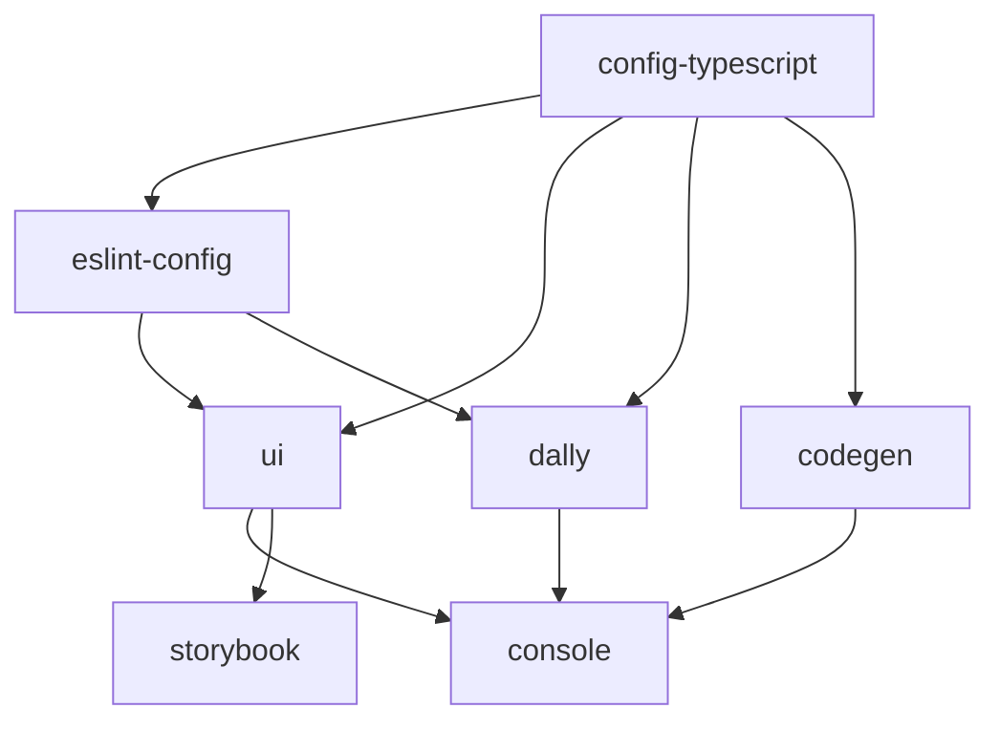

## Applications

The monorepo contains two production applications:

<CardGroup cols={2}>
  <Card title="Console" icon="window" href="https://console.theopenlane.io/">
    Main Openlane Console application
  </Card>
  <Card title="Storybook" icon="book" href="https://storybook.theopenlane.io/">
    Component documentation and testing
  </Card>
</CardGroup>

### Console (`apps/console`)

The primary web application for Openlane users.

<Accordion title="Package Details">
**Name:** `console`  
**Version:** 1.0.0  
**Port:** 3001  
**Framework:** Next.js 16.1.6

**Key Dependencies:**
- `next@16.1.6` - Application framework
- `react@19.2.4` - UI library
- `@tanstack/react-query@^5.66.9` - Data fetching and caching
- `next-auth@beta` - Authentication
- `stripe@^18.5.0` - Payment processing
- `@repo/ui` - Shared component library
- `@repo/codegen` - GraphQL API client
- `@repo/dally` - Data access layer

**Features:**
- Authentication with GitHub and Google OAuth
- Stripe billing integration
- AI-powered features using Amazon Bedrock and Google Vertex AI
- Real-time notifications with Novu
- WebAuthn passkey support
- Survey creation with SurveyJS
- Interactive force-directed graphs
- PDF generation and viewing
</Accordion>

<Accordion title="Scripts">
| Command | Description |
|---------|-------------|
| `dev` | Start development server on port 3001 |
| `build` | Build production bundle |
| `debug` | Build with memory debugging |
| `start` | Start production server on port 3001 |
| `lint` | Lint codebase |
| `test` | Run Jest tests |
</Accordion>

### Storybook (`apps/storybook`)

Component library documentation and visual testing environment.

<Accordion title="Package Details">
**Name:** `openlane-storybook`  
**Version:** 0.0.0  
**Port:** 6006  
**Framework:** Storybook 10.2.13

**Key Dependencies:**
- `storybook@10.2.13` - Component development environment
- `@repo/ui` - Component library being documented
- `@tanstack/react-query@^5.90.11` - Data fetching examples
- `@storybook/react-vite@10.2.13` - Vite integration
- `vite@^7.0.0` - Build tool

**Addons:**
- `@storybook/addon-a11y` - Accessibility testing
- `@storybook/addon-docs` - Auto-generated documentation
- `@storybook/addon-themes` - Theme switching
- `@chromatic-com/storybook` - Visual regression testing
</Accordion>

<Accordion title="Scripts">
| Command | Description |
|---------|-------------|
| `dev` | Start Storybook dev server on port 6006 |
| `build` | Build static Storybook site |
| `storybook` | Alias for dev command |
| `lint` | Lint Storybook files |
</Accordion>

## Shared Packages

Five internal packages provide shared functionality:

### @repo/ui (`packages/ui`)

Comprehensive React component library built with Radix UI and Tailwind CSS.

<Accordion title="Package Details">
**Version:** 0.0.0 (private)  
**Exports:** 70+ components and utilities

**Core Technologies:**
- `react@19.2.4` - UI framework
- `next@16.1.6` - Framework integration
- `tailwindcss@^4.1.13` - Styling (v4)
- `@radix-ui/*` - Accessible component primitives
- `platejs@^49.1.5` - Rich text editor
- `recharts@^3.2.0` - Data visualization

**Component Categories:**
- **Forms:** Input, Textarea, Select, Checkbox, Switch, Radio, Calendar, Tag Input
- **Data Display:** Table, Data Table, Charts (Line, Donut), Badge, Avatar
- **Feedback:** Alert, Toast, Dialog, Confirmation Dialog, Progress
- **Navigation:** Breadcrumb, Tabs, Pagination, Command Menu
- **Layout:** Grid, Panel, Card, Sheet, Separator
- **Rich Text:** Plate.js editor with 30+ plugins
- **Advanced:** Global Search, Infinite Scroll, Country Dropdown
</Accordion>

<Accordion title="Key Features">
- **Accessibility:** Built on Radix UI primitives
- **Type Safety:** Full TypeScript support
- **Styling:** Tailwind CSS v4 with custom design system
- **Form Handling:** React Hook Form integration
- **AI Integration:** AI SDK for suggestions and autocomplete
- **Rich Text:** Advanced markdown editor with Plate.js
- **Internationalization:** Country flags and localization support
</Accordion>

<Accordion title="Sample Exports">
```typescript
import { Button } from '@repo/ui/button'
import { DataTable } from '@repo/ui/data-table'
import { useToast } from '@repo/ui/use-toast'
import { LineChart } from '@repo/ui/line-chart'
import { Calendar } from '@repo/ui/calendar'
```
</Accordion>

### @repo/codegen (`packages/codegen`)

GraphQL code generator for type-safe API interactions.

<Accordion title="Package Details">
**Version:** 0.0.0  
**Purpose:** Generate TypeScript types and hooks from GraphQL schema

**Dependencies:**
- `graphql@16.13.0` - GraphQL implementation
- `graphql-request@7.4.0` - GraphQL client
- `@graphql-codegen/cli@6.1.2` - Code generation CLI
- `@graphql-codegen/typescript@5.0.8` - TypeScript plugin
- `@graphql-codegen/typescript-operations@5.0.8` - Operations plugin
- `@graphql-codegen/typescript-react-query@^6.1.0` - React Query integration
</Accordion>

<Accordion title="How It Works">
1. **Define Queries:** Create `.graphql` files in `/query` directory
2. **Generate Code:** Run `bun run codegen` to generate TypeScript
3. **Use Hooks:** Import generated hooks in your components

```graphql
# query/organization.graphql
query GetOrganization($id: ID!) {
  organization(id: $id) {
    id
    name
    createdAt
  }
}
```

```typescript
// Generated hook usage
import { useGetOrganizationQuery } from '@repo/codegen/src/schema'

const { data, loading } = useGetOrganizationQuery({ id: 'org-123' })
```
</Accordion>

<Accordion title="Configuration">
Configured via `graphql-codegen.yml` to:
- Introspect the Openlane GraphQL API
- Generate TypeScript types
- Create React Query hooks
- Include proper error handling
</Accordion>

### @repo/dally (`packages/dally`)

Data Access Layer (DAL) for common patterns and functionality.

<Accordion title="Package Details">
**Version:** 0.0.0 (private)  
**Language:** TypeScript

**Exports:**
- `./auth` - Authentication utilities
- `./user` - User management functions
- `./chat` - Chat functionality
- `./ai` - AI integration helpers

**Build Process:**
- Compiled with TypeScript
- Supports watch mode for development
- Type checking enabled
</Accordion>

<Accordion title="Scripts">
| Command | Description |
|---------|-------------|
| `build` | Compile TypeScript to JavaScript |
| `dev` | Watch mode compilation |
| `type-check` | Verify types without emitting |
| `lint` | Lint source files |
</Accordion>

### @repo/eslint-config (`packages/eslint-config`)

Shared ESLint configurations for consistent code quality.

<Accordion title="Package Details">
**Version:** 0.0.0 (private)  
**Type:** ES Module

**Exports:**
- `./base` - Base ESLint configuration
- `./next-js` - Next.js-specific rules
- `./react-internal` - React component rules

**Included Plugins:**
- `@next/eslint-plugin-next@^16.1.6` - Next.js best practices
- `eslint-plugin-react@^7.37.5` - React rules
- `eslint-plugin-react-hooks@^7.0.1` - Hooks rules
- `eslint-plugin-turbo@^2.8.9` - Turborepo rules
- `eslint-config-prettier@^10.1.1` - Prettier integration
- `typescript-eslint@^8.30.1` - TypeScript rules
</Accordion>

### @repo/typescript-config (`packages/config-typescript`)

Shared TypeScript configurations for consistent type checking.

<Accordion title="Package Details">
**Version:** 0.0.0 (private)  
**License:** MIT

**Purpose:**
- Provides base `tsconfig.json` files
- Ensures consistent compiler options
- Shared across all packages and apps
</Accordion>

## Package Dependency Graph



## Cross-Package Usage

<Accordion title="Console Dependencies">
The Console app depends on:
- `@repo/ui` - All UI components
- `@repo/codegen` - GraphQL API client
- `@repo/dally` - Authentication and data utilities
- `@repo/typescript-config` - TypeScript configuration
- `@repo/eslint-config` - Linting rules
</Accordion>

<Accordion title="Storybook Dependencies">
Storybook depends on:
- `@repo/ui` - Components being documented
- `@repo/typescript-config` - TypeScript configuration
- `@repo/eslint-config` - Linting rules
</Accordion>

## Development Workflow

<Steps>
  <Step title="Install Dependencies">
    Run `bun install` at the root to install all workspace dependencies
  </Step>
  
  <Step title="Build Packages">
    Run `bun run build` to build all packages in dependency order
  </Step>
  
  <Step title="Start Development">
    Run `bun run dev` to start all apps in parallel with hot reload
  </Step>
  
  <Step title="Make Changes">
    Edit files in any package - Turborepo will automatically rebuild dependents
  </Step>
</Steps>

## Version Management

<Info>
  All packages use `"version": "0.0.0"` because they are private and not published to npm. Version management is handled at the monorepo level.
</Info>

## Related Resources

<CardGroup cols={2}>
  <Card title="Monorepo Structure" icon="sitemap" href="/architecture/monorepo">
    Learn about the Turborepo architecture
  </Card>
  <Card title="Tech Stack" icon="layer-group" href="/architecture/tech-stack">
    Explore the complete technology stack
  </Card>
</CardGroup>