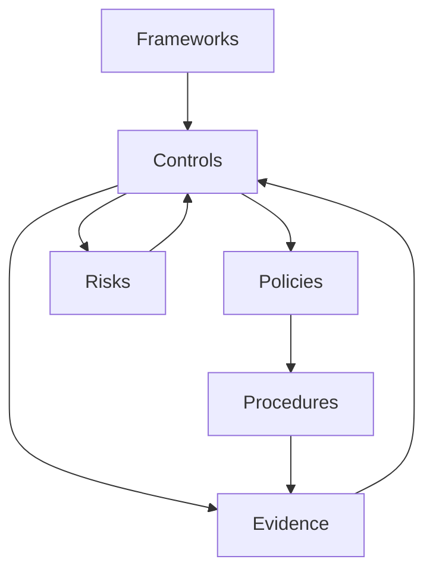

## Overview

Openlane Console provides a complete compliance management system with five core modules: Controls, Policies, Procedures, Risks, and Evidence. These modules work together to help organizations achieve and maintain compliance across multiple frameworks.

<Note>
All compliance features are located in the `/app/(protected)` directory and share common patterns for CRUD operations, filtering, and relationship mapping.
</Note>

## Controls

Security controls are the foundation of compliance programs. Controls represent security measures, safeguards, and processes that protect your organization.

### Control Structure

Controls can be organized hierarchically:

```
Control (Parent)
├── Subcontrol 1
├── Subcontrol 2
└── Subcontrol 3
    ├── Control Objective 1
    └── Control Objective 2
```

### Control Management

Access controls at `/controls`:

```typescript
// apps/console/src/app/(protected)/controls/page.tsx
const Page: React.FC = () => {
  return <ControlSwitcher />
}
```

<Tabs>
  <Tab title="View Controls">
    The Control Switcher provides multiple views:
    
    - **List View**: Tabular display of all controls
    - **Tree View**: Hierarchical visualization
    - **Framework View**: Grouped by compliance framework
    - **Status View**: Filtered by implementation status
    
    Controls can be filtered by:
    - Framework (SOC 2, ISO 27001, HIPAA, etc.)
    - Status (Not Started, In Progress, Implemented, Verified)
    - Owner/Assignee
    - Tags and categories
  </Tab>
  
  <Tab title="Create Control">
    Navigate to `/controls/create-control` to create a new control:
    
    <Steps>
      <Step title="Basic Information">
        - Control name (e.g., "Access Control")
        - Control ID/Reference (e.g., "CC6.1")
        - Description
        - Category/Family
      </Step>
      
      <Step title="Control Details">
        - Control type (Preventive, Detective, Corrective)
        - Implementation status
        - Owner and assignees
        - Due date
        - Priority level
      </Step>
      
      <Step title="Framework Mapping">
        Map control to compliance frameworks:
        - SOC 2 Trust Service Criteria
        - ISO 27001 Annex A controls
        - NIST CSF categories
        - Custom frameworks
      </Step>
      
      <Step title="Evidence Requirements">
        Define what evidence is needed:
        - Evidence type (screenshots, logs, policies)
        - Collection frequency
        - Acceptance criteria
      </Step>
    </Steps>
  </Tab>
  
  <Tab title="Subcontrols">
    Create subcontrols for complex controls:
    
    ```typescript
    // Navigate to parent control
    /controls/{parentId}/create-subcontrol
    ```
    
    **Use Cases for Subcontrols**:
    - Break down complex controls into manageable pieces
    - Assign different aspects to different owners
    - Track implementation progress granularly
    - Map to multiple framework requirements
  </Tab>
  
  <Tab title="Control Objectives">
    Define specific objectives for controls:
    
    ```typescript
    /controls/{controlId}/control-objectives
    ```
    
    Example objectives for Access Control:
    - "Ensure only authorized users access systems"
    - "Implement least privilege access"
    - "Review access rights quarterly"
    - "Disable inactive accounts within 30 days"
  </Tab>
</Tabs>

### Control Implementation

Track control implementation at `/controls/{id}/control-implementation`:

<AccordionGroup>
  <Accordion title="Implementation Phases">
    1. **Design**: Define how the control will be implemented
    2. **Build**: Implement technical/process controls
    3. **Test**: Validate control effectiveness
    4. **Operate**: Put control into production
    5. **Monitor**: Ongoing effectiveness monitoring
  </Accordion>
  
  <Accordion title="Implementation Evidence">
    Document implementation with:
    - Configuration screenshots
    - Policy documents
    - Procedure documentation
    - Training materials
    - Test results
  </Accordion>
  
  <Accordion title="Control Testing">
    Regular testing validates effectiveness:
    - **Frequency**: Monthly, quarterly, or annually
    - **Test Procedures**: Step-by-step validation
    - **Sample Selection**: Items to test
    - **Expected Results**: Pass/fail criteria
    - **Actual Results**: Test outcomes
  </Accordion>
</AccordionGroup>

### Control Mapping

Map controls to frameworks at `/controls/{id}/map-control`:

```typescript
// Map a control to multiple frameworks
const mappedFrameworks = [
  { framework: 'SOC 2', criteria: 'CC6.1' },
  { framework: 'ISO 27001', control: 'A.9.2.1' },
  { framework: 'NIST CSF', category: 'PR.AC-1' },
]
```

Edit mappings at `/controls/{id}/edit-map-control`.

### Clone Controls

Duplicate existing controls at `/controls/{id}/clone-control`:

- Copy control structure and objectives
- Maintain framework mappings
- Reset implementation status
- Assign to new owner

<Note>
Cloning is useful for:
- Creating similar controls for different systems
- Reusing control templates
- Standardizing across departments
</Note>

## Policies

Internal policies document organizational rules and requirements.

### Policy Management

Access policies at `/policies`:

```typescript
// apps/console/src/app/(protected)/policies/page.tsx
const Page: React.FC = () => {
  return <PolicySwitcher />
}
```

<Tabs>
  <Tab title="Create Policy">
    Navigate to `/policies/create` to create a policy:
    
    - **Policy Name**: e.g., "Information Security Policy"
    - **Policy Number**: Document control number
    - **Version**: Version tracking (1.0, 2.0, etc.)
    - **Owner**: Policy owner/sponsor
    - **Approver**: Who must approve changes
    - **Review Schedule**: How often to review
    - **Effective Date**: When policy takes effect
    - **Content**: Full policy text (supports Markdown)
  </Tab>
  
  <Tab title="Policy Lifecycle">
    <Steps>
      <Step title="Draft">
        Initial policy creation and editing
      </Step>
      <Step title="Review">
        Stakeholder review and feedback
      </Step>
      <Step title="Approval">
        Formal approval by designated approver
      </Step>
      <Step title="Published">
        Active policy in effect
      </Step>
      <Step title="Retired">
        Policy no longer in effect (archived)
      </Step>
    </Steps>
  </Tab>
  
  <Tab title="Version Control">
    Track policy changes:
    - Version history
    - Change log
    - Diff view between versions
    - Rollback capability
    - Approval trail
  </Tab>
  
  <Tab title="Policy Relationships">
    Link policies to:
    - **Controls**: Which controls implement the policy
    - **Procedures**: How the policy is executed
    - **Risks**: What risks the policy mitigates
    - **Frameworks**: Which frameworks require the policy
  </Tab>
</Tabs>

### Policy Templates

Common policy templates:

- Information Security Policy
- Acceptable Use Policy
- Access Control Policy
- Data Classification Policy
- Incident Response Policy
- Business Continuity Policy
- Vendor Management Policy
- Privacy Policy

## Procedures

Procedures provide step-by-step instructions for implementing policies and controls.

### Procedure Management

Access procedures at `/procedures`:

```typescript
// apps/console/src/app/(protected)/procedures/page.tsx
const Page: React.FC = () => {
  return (
    <>
      <PageHeading heading="Procedures" />
      <ProceduresTable />
    </>
  )
}
```

<Tabs>
  <Tab title="Create Procedure">
    Navigate to `/procedures/create`:
    
    - **Title**: e.g., "User Provisioning Procedure"
    - **Procedure ID**: Reference number
    - **Related Policy**: Link to governing policy
    - **Owner**: Procedure owner
    - **Frequency**: How often executed (daily, monthly, etc.)
    - **Steps**: Detailed step-by-step instructions
    - **Roles**: Who performs each step
    - **Tools**: Systems/tools used
    - **Evidence**: What evidence is generated
  </Tab>
  
  <Tab title="Procedure Format">
    Procedures support rich formatting:
    
    ```markdown
    ## Purpose
    This procedure defines the process for provisioning new user accounts.
    
    ## Scope
    Applies to all new employees and contractors.
    
    ## Procedure Steps
    
    ### 1. Request Submission
    - Manager submits access request ticket
    - Include: user name, role, start date, required systems
    
    ### 2. Approval
    - IT Security reviews request
    - Verifies appropriate access for role
    - Approves or denies within 24 hours
    
    ### 3. Account Creation
    - IT provisions accounts in required systems
    - Assigns appropriate group memberships
    - Sends credentials via secure channel
    
    ### 4. Documentation
    - Log provisioning in access management system
    - Attach approval to ticket
    - Close ticket
    ```
  </Tab>
  
  <Tab title="Execution Tracking">
    Track procedure executions:
    - Execution date/time
    - Performed by
    - Results/outcomes
    - Any deviations
    - Evidence collected
    - Next scheduled execution
  </Tab>
</Tabs>

## Risks

Risk management identifies, assesses, and mitigates organizational risks.

### Risk Management

Access risks at `/risks`:

```typescript
// apps/console/src/app/(protected)/risks/page.tsx
const RisksPage: React.FC = () => <RiskTable />
```

<Tabs>
  <Tab title="Create Risk">
    Navigate to `/risks/create`:
    
    <Steps>
      <Step title="Risk Identification">
        - Risk title/description
        - Risk category (Security, Privacy, Operational, etc.)
        - Risk source (Internal, External, Third-party)
        - Affected assets/systems
      </Step>
      
      <Step title="Risk Assessment">
        **Likelihood** (1-5):
        - 1: Rare (< 10% probability)
        - 2: Unlikely (10-30%)
        - 3: Possible (30-50%)
        - 4: Likely (50-70%)
        - 5: Almost Certain (> 70%)
        
        **Impact** (1-5):
        - 1: Negligible
        - 2: Minor
        - 3: Moderate
        - 4: Major
        - 5: Catastrophic
        
        **Risk Score** = Likelihood × Impact (1-25)
      </Step>
      
      <Step title="Risk Treatment">
        Choose treatment strategy:
        - **Mitigate**: Implement controls to reduce risk
        - **Accept**: Accept the risk (document justification)
        - **Transfer**: Transfer to third party (insurance, outsourcing)
        - **Avoid**: Eliminate the risk source
      </Step>
      
      <Step title="Mitigation Plan">
        For mitigated risks:
        - Mitigation controls to implement
        - Target completion date
        - Responsible party
        - Residual risk score
      </Step>
    </Steps>
  </Tab>
  
  <Tab title="Risk Register">
    The risk register displays:
    
    | Risk | Category | Inherent Risk | Residual Risk | Status | Owner |
    |------|----------|---------------|---------------|--------|-------|
    | Data breach via stolen credentials | Security | 20 (High) | 8 (Medium) | Mitigating | CISO |
    | Ransomware attack | Security | 25 (Critical) | 10 (Medium) | Mitigating | IT Director |
    | Third-party vendor breach | Security | 15 (High) | 6 (Low) | Mitigated | Vendor Manager |
    
    Color coding:
    - **Critical (20-25)**: Red
    - **High (15-19)**: Orange  
    - **Medium (8-14)**: Yellow
    - **Low (1-7)**: Green
  </Tab>
  
  <Tab title="Risk Monitoring">
    Ongoing risk monitoring:
    - Regular reassessment (quarterly/annually)
    - Track risk trend (increasing/decreasing)
    - Monitor mitigation progress
    - Update based on incidents
    - Report to leadership
  </Tab>
  
  <Tab title="Risk Relationships">
    Link risks to:
    - **Controls**: Controls that mitigate the risk
    - **Policies**: Policies that address the risk
    - **Incidents**: Related security incidents
    - **Frameworks**: Framework risk requirements
  </Tab>
</Tabs>

### Risk Heat Map

Visualize risk portfolio:

```
         Impact →
      1    2    3    4    5
L  1  ░    ░    ░    ▒    ▒
i  2  ░    ▒    ▒    ▒    ▓
k  3  ░    ▒    ▒    ▓    ▓
e  4  ▒    ▒    ▓    ▓    █
l  5  ▒    ▓    ▓    █    █
i
h
o
o
d
↓

░ = Low (1-7)
▒ = Medium (8-14)  
▓ = High (15-19)
█ = Critical (20-25)
```

## Evidence

Evidence collection provides proof of control effectiveness and compliance.

### Evidence Management

Access evidence at `/evidence`:

```typescript
// apps/console/src/app/(protected)/evidence/page.tsx
const Page: React.FC = () => <EvidenceDetailsPage />
```

<Tabs>
  <Tab title="Upload Evidence">
    Navigate to `/evidence/create` to upload evidence:
    
    <Steps>
      <Step title="Select Evidence Type">
        - Screenshots
        - Log files
        - Reports (PDF, DOCX)
        - Configuration exports
        - Audit reports
        - Training certificates
        - Meeting minutes
      </Step>
      
      <Step title="Upload Files">
        ```typescript
        // React Dropzone for file uploads
        <Dropzone
          onDrop={handleFileDrop}
          accept={{
            'image/*': ['.png', '.jpg', '.jpeg'],
            'application/pdf': ['.pdf'],
            'text/*': ['.txt', '.log'],
          }}
        />
        ```
        
        Files are uploaded to Cloudflare R2:
        ```typescript
        // next.config.mjs
        images: {
          remotePatterns: [
            {
              protocol: 'https',
              hostname: '*.r2.cloudflarestorage.com',
            },
          ],
        }
        ```
      </Step>
      
      <Step title="Associate Evidence">
        Link evidence to:
        - Specific controls
        - Test procedures
        - Compliance frameworks
        - Audit requests
        - Risks (as proof of mitigation)
      </Step>
      
      <Step title="Add Metadata">
        - Evidence date (when it was created)
        - Collection date (when uploaded)
        - Validity period (how long it's valid)
        - Description/notes
        - Tags for organization
      </Step>
    </Steps>
  </Tab>
  
  <Tab title="Evidence Repository">
    Browse and search evidence:
    
    - Filter by control
    - Filter by date range
    - Search by filename or description
    - Group by framework
    - Sort by upload date
    - View evidence lineage
  </Tab>
  
  <Tab title="Evidence Review">
    Review evidence for audits:
    
    - Mark evidence as reviewed
    - Add reviewer comments
    - Request additional evidence
    - Approve/reject evidence
    - Generate evidence packages for auditors
  </Tab>
  
  <Tab title="Automated Collection">
    Some evidence can be collected automatically:
    
    - System logs via integrations
    - Access reviews from IdP
    - Vulnerability scans
    - Configuration snapshots
    - Monitoring alerts
    
    Configure in **Organization Settings → Integrations**
  </Tab>
</Tabs>

### Evidence Viewing

The Console supports viewing various file types:

- **Images**: Inline image viewer with zoom
- **PDFs**: Embedded PDF viewer using react-pdf
- **Text/Logs**: Syntax-highlighted text viewer
- **Documents**: Download for external viewing

## Cross-Module Relationships

All compliance modules are interconnected:



<AccordionGroup>
  <Accordion title="Framework → Controls">
    Frameworks define required controls:
    - SOC 2 requires CC6.1 (logical access controls)
    - ISO 27001 requires A.9.2.1 (user registration)
  </Accordion>
  
  <Accordion title="Controls → Policies">
    Controls implement policies:
    - Access Control policy implemented by authentication control
  </Accordion>
  
  <Accordion title="Policies → Procedures">
    Procedures operationalize policies:
    - Access Control policy executed via User Provisioning procedure
  </Accordion>
  
  <Accordion title="Controls → Risks">
    Controls mitigate risks:
    - MFA control mitigates credential theft risk
  </Accordion>
  
  <Accordion title="Controls → Evidence">
    Evidence proves control effectiveness:
    - Screenshot of MFA configuration
    - Report of MFA adoption rate
  </Accordion>
</AccordionGroup>

## Next Steps

<CardGroup cols={2}>
  <Card title="Dashboard" icon="chart-line" href="/console/dashboard">
    Monitor compliance status
  </Card>
  <Card title="Organizations" icon="building" href="/console/organizations">
    Manage multi-organization compliance
  </Card>
  <Card title="Automation" icon="robot" href="/console/automation">
    Automate assessments and tasks
  </Card>
  <Card title="API Reference" icon="code" href="/api-reference">
    Integrate compliance data
  </Card>
</CardGroup>