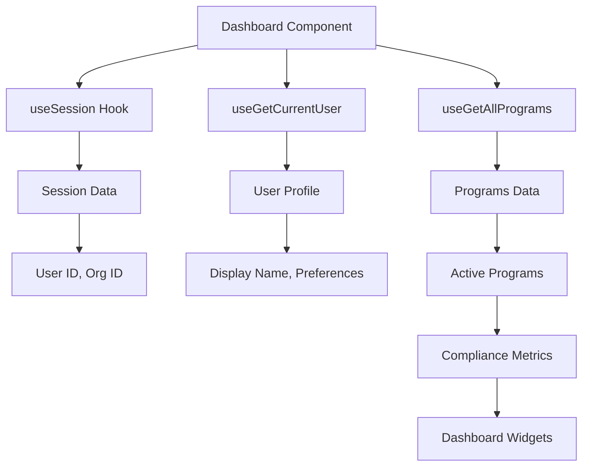

## Overview

The Dashboard (`/dashboard`) is the primary landing page after authentication, providing a comprehensive overview of your organization's compliance posture, suggested actions, and quick access to key features.

<Note>
The dashboard is located at `/app/(protected)/dashboard/page.tsx` and uses the `DashboardPage` component.
</Note>

## Dashboard Layout

The dashboard is organized into distinct sections designed for quick comprehension and action:

```typescript
// apps/console/src/components/pages/protected/dashboard/dashboard-page.tsx
const DashboardPage: React.FC = () => {
  return (
    <div className="max-w-[1076px] mx-auto w-full px-4 flex flex-col gap-4">
      {/* Welcome Header */}
      <div>
        <p className="text-3xl">Welcome, {userData?.user?.displayName}!</p>
        <p className="text-muted-foreground">
          Here's what's happening in your organization.
        </p>
      </div>

      {/* Quick Actions */}
      <DashboardActions />
      
      {/* Compliance Overview */}
      <DashboardComplianceOverview />

      {/* Bottom Grid */}
      <div className="grid grid-cols-2 gap-4">
        <DashboardSuggestedActions />
        <DashboardViewDocumentation />
        <DashboardContactSupport />
      </div>
    </div>
  )
}
```

## Dashboard Components

### Welcome Section

Personalized greeting with the user's display name pulled from session data:

<Steps>
  <Step title="Session Data Retrieval">
    ```typescript
    const { data: sessionData } = useSession()
    const userId = sessionData?.user?.userId
    const { data: userData } = useGetCurrentUser(userId)
    ```
  </Step>
  
  <Step title="Display Name">
    Shows user's display name: `Welcome, {userData?.user?.displayName}!`
  </Step>
  
  <Step title="Context Message">
    Provides context: "Here's what's happening in your organization."
  </Step>
</Steps>

### Dashboard Actions

Quick action buttons for common tasks:

<CardGroup cols={3}>
  <Card title="Create Control" icon="shield">
    Navigate to control creation flow
  </Card>
  <Card title="Create Policy" icon="file-text">
    Start a new internal policy
  </Card>
  <Card title="Create Procedure" icon="list-checks">
    Document a new procedure
  </Card>
  <Card title="Create Risk" icon="triangle-alert">
    Log a new organizational risk
  </Card>
  <Card title="Upload Evidence" icon="upload">
    Add compliance evidence
  </Card>
  <Card title="Create Program" icon="folder">
    Start a compliance program
  </Card>
</CardGroup>

### Compliance Overview

Real-time compliance status across active programs:

<Tabs>
  <Tab title="Program Filtering">
    ```typescript
    const { data, isLoading } = useGetAllPrograms({
      where: {
        statusNotIn: [
          ProgramProgramStatus.COMPLETED,
          ProgramProgramStatus.ARCHIVED
        ],
      },
    })
    ```
    
    Automatically filters out completed and archived programs to show only active compliance efforts.
  </Tab>
  
  <Tab title="Metrics Display">
    The compliance overview typically shows:
    
    - **Program Progress**: Percentage completion of active programs
    - **Control Status**: Number of implemented vs. planned controls
    - **Evidence Collection**: Evidence collection status
    - **Risk Levels**: Distribution of risks by severity
    - **Upcoming Tasks**: Count of pending compliance tasks
  </Tab>
  
  <Tab title="Program Selector">
    ```typescript
    const searchParams = useSearchParams()
    const programId = searchParams.get('id')
    const [selectedProgram, setSelectedProgram] = useState('All programs')
    
    // Build program map for quick lookup
    const programMap = useMemo(() => {
      const map: Record<string, string> = {}
      data?.programs?.edges?.forEach((edge) => {
        if (edge?.node) {
          map[edge.node.id] = edge.node.name
        }
      })
      return map
    }, [data])
    ```
    
    Filter dashboard data by specific program via `?id=program_123` query param.
  </Tab>
</Tabs>

### Suggested Actions

AI-powered or rule-based recommendations for improving compliance posture:

<AccordionGroup>
  <Accordion title="Action Types">
    - **Missing Controls**: Identify gaps in control coverage
    - **Evidence Needed**: Controls requiring evidence
    - **Policy Reviews**: Policies due for review
    - **Risk Assessments**: Risks needing reassessment
    - **Task Overdue**: Past-due compliance tasks
  </Accordion>
  
  <Accordion title="AI Suggestions">
    When enabled with Google AI integration:
    
    ```bash
    NEXT_PUBLIC_AI_SUGGESTIONS_ENABLED=true
    GOOGLE_AI_PROJECT_ID=your-project-id
    GOOGLE_AI_REGION=us-central1
    GOOGLE_AI_MODEL_NAME=gemini-pro
    GOOGLE_GENERATIVE_AI_API_KEY=your-api-key
    ```
    
    The Console can provide intelligent recommendations based on:
    - Industry best practices
    - Compliance framework requirements
    - Organizational patterns and history
    - RAG-enhanced context from compliance documentation
  </Accordion>
  
  <Accordion title="Action Priority">
    Suggested actions are prioritized by:
    1. **Critical**: Compliance gaps that could affect audit readiness
    2. **High**: Important improvements with significant impact
    3. **Medium**: Recommended optimizations
    4. **Low**: Nice-to-have enhancements
  </Accordion>
</AccordionGroup>

### View Documentation

Quick links to relevant documentation:

- Getting started guides
- Feature documentation
- Compliance framework guides
- API documentation
- Video tutorials

### Contact Support

Integrated support options:

<Tabs>
  <Tab title="DevRev Chat">
    When configured with DevRev:
    
    ```bash
    DEVREV_AAT=your_devrev_token
    ```
    
    Provides in-app chat support with your customer success team.
  </Tab>
  
  <Tab title="Support Resources">
    - Live chat (when available)
    - Email support
    - Knowledge base
    - Community forum
    - Schedule demo/consultation
  </Tab>
</Tabs>

## Data Flow

The dashboard fetches data from multiple sources:



### GraphQL Queries

The dashboard uses TanStack Query with GraphQL:

```typescript
// Fetch all programs
const { data, isLoading } = useGetAllPrograms({
  where: {
    statusNotIn: [COMPLETED, ARCHIVED],
  },
})

// Fetch current user
const { data: userData } = useGetCurrentUser(userId)

// Real-time updates via GraphQL subscriptions
const GRAPHQL_ENDPOINT = process.env.NEXT_PUBLIC_API_GQL_URL!
```

<Note>
Dashboard data is cached by TanStack Query and automatically revalidated on window focus or network reconnection.
</Note>

## Breadcrumb Navigation

The dashboard sets breadcrumb context:

```typescript
const { setCrumbs } = React.useContext(BreadcrumbContext)

useEffect(() => {
  setCrumbs([{ label: 'Home', href: '/dashboard' }])
}, [setCrumbs])
```

Breadcrumbs help users understand their location and navigate back:

```
Home
Home > Controls
Home > Controls > SOC 2 Type II
Home > Controls > SOC 2 Type II > CC1.1
```

## Loading States

The dashboard implements loading states for better UX:

```typescript
if (isLoading) return <Loading />

// apps/console/src/app/(protected)/dashboard/loading.tsx
const Loading = () => {
  return (
    <div className="flex items-center justify-center h-screen">
      <Spinner size="lg" />
    </div>
  )
}
```

<Warning>
Avoid blocking the entire dashboard while fetching data. Use skeleton loaders for individual sections to improve perceived performance.
</Warning>

## Customization

### Dashboard Widgets

Organizations can customize dashboard widgets based on:

- **User Role**: Show different metrics for auditors vs. engineers
- **Organization Type**: Industry-specific compliance metrics
- **Active Programs**: Dynamically adjust based on compliance programs
- **User Preferences**: Saved dashboard layouts and filters

### Filtering and Search

Dashboard data can be filtered by:

```typescript
// URL query params
/dashboard?id=program_123              // Specific program
/dashboard?status=in_progress          // Program status
/dashboard?assignee=user_456           // Assigned to user
```

## Performance Optimization

The dashboard is optimized for performance:

<AccordionGroup>
  <Accordion title="Data Fetching">
    - **Parallel Queries**: Multiple data sources fetched in parallel
    - **Query Caching**: TanStack Query caches results
    - **Stale-While-Revalidate**: Show cached data while fetching fresh data
    - **Query Invalidation**: Smart cache invalidation on mutations
  </Accordion>
  
  <Accordion title="Rendering">
    - **useMemo**: Expensive computations memoized
    - **React 19**: Automatic batching and concurrent features
    - **Code Splitting**: Dashboard components lazy-loaded
    - **Image Optimization**: Next.js Image component for logos/avatars
  </Accordion>
  
  <Accordion title="Bundle Size">
    - **Tailwind CSS**: Purged unused styles
    - **Tree Shaking**: Unused code eliminated
    - **Dynamic Imports**: Heavy components loaded on demand
    - **Font Optimization**: Next.js font optimization
  </Accordion>
</AccordionGroup>

## Accessibility

The dashboard follows WCAG 2.1 AA standards:

- **Semantic HTML**: Proper heading hierarchy
- **ARIA Labels**: Screen reader support
- **Keyboard Navigation**: Full keyboard access
- **Focus Management**: Visible focus indicators
- **Color Contrast**: Meets WCAG contrast ratios
- **Responsive Design**: Mobile-friendly layouts

## Next Steps

<CardGroup cols={2}>
  <Card title="Compliance Features" icon="shield-check" href="/console/compliance-features">
    Explore controls, policies, procedures, risks, and evidence
  </Card>
  <Card title="Organizations" icon="building" href="/console/organizations">
    Manage multiple organizations
  </Card>
  <Card title="API Integration" icon="code" href="/api-reference">
    Integrate with dashboard APIs
  </Card>
  <Card title="Deployment" icon="rocket" href="/console/deployment">
    Configure dashboard for production
  </Card>
</CardGroup>